# Water Plant Project

## 7/13/2019

### Ideation of project

- Make a automatic plant watering system
- Extend it so that it can be controlled by the phone
  - And try to make it so that you can access it outside of the network

### Possible Issues

- Actually building the final product
- How do we access the thing outside of the home network if it’s a local server >:(

### Prototyping for the Project

- Built a basic Arduino system that uses the water level sensor as a simple switch and an input while the LED is on a separate circuit

    | 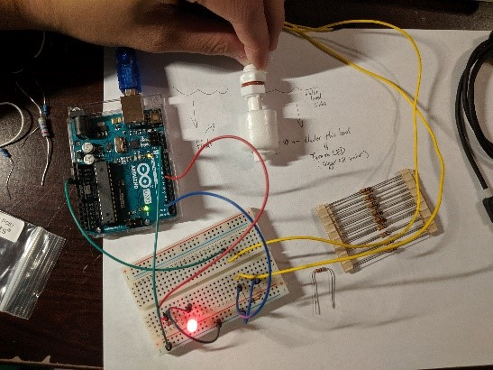 | 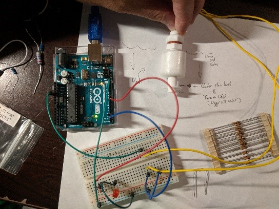 |
    |-|-|

    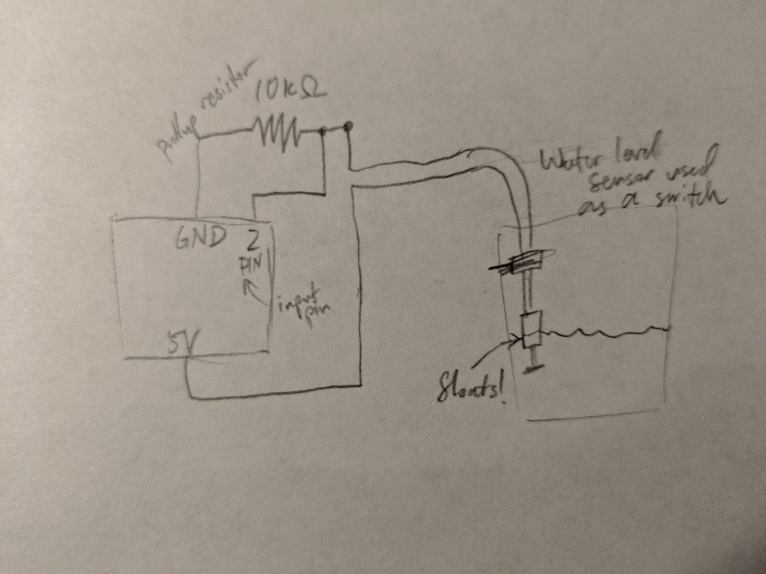

### Code

```arduino
const int buttonPin = 2;
const int ledPin =  7;

int buttonState = 0;

void setup() {
  pinMode(ledPin, OUTPUT);
  pinMode(buttonPin, INPUT);
}

void loop() {
  buttonState = digitalRead(buttonPin);
  if (buttonState == HIGH) {
    digitalWrite(ledPin, HIGH);
  } else {
    digitalWrite(ledPin, LOW);
  }
}
```

### Reflection

I need to buy a wifi module and start to build prototypes for a plant box to test

## 7/14/2019

### Brainstorming

Use an ESP8266 to make a server using the Arduino from local wifi host and access it w/ local device

- This is good for testing; still don’t know how to extend it outside of the house
- Esp encryption of the data
- But it should be pretty easy to setup a webpage using the library
- [Arduino Web Server Documentation](https://arduino-esp8266.readthedocs.io/en/latest/esp8266wifi/server-examples.html)

If we have an external server, we can use this library to connect to it and make HTTP requests

- [Quick Start](https://arduino-esp8266.readthedocs.io/en/latest/esp8266wifi/readme.html)
- But servers cost monieeee :(

### To Buy

Need:

- [ESP8266 NodeMCU](https://www.amazon.com/dp/B07PR9T5R5/ref=twister_B07NMJN9VK?_encoding=UTF8&psc=1)
- [Breadboards](https://www.amazon.com/EL-CP-003-Breadboard-Solderless-Distribution-Connecting/dp/B01EV6LJ7G?ref_=fsclp_pl_dp_3&th=1)

In case we need more:

- [Arduino UNO Rev 3](https://www.amazon.com/Arduino-A000066-ARDUINO-UNO-R3/dp/B008GRTSV6)
- [Float Switches](https://www.amazon.com/Anndason-Pieces-Plastic-Switch-Liquid/dp/B07211T6Y6/ref=zg_bs_306931011_2?_encoding=UTF8&psc=1&refRID=H59S8J92DXSM986SGS1R)

### Reflection

Not much coding done today, but I will buy the materials to start working on the UI component. I need to start figuring out how to wire a water valve and have a tank to fill it up.

## 7/21/2019

### Research on how to connect the ESP8266 NodeMCU board

- So basically it wasn’t the wifi module I bought but something bigger???
- Anyways, here’s a really helpful link:
- [Node MCU Quickstart](https://www.instructables.com/id/Quick-Start-to-Nodemcu-ESP8266-on-Arduino-IDE/)

### Notes on connecting the board

- YOU DON’T EVEN NEED THE ARDUINO HAHAHAHHAHAHA
- That ESP8266 NodeMCU board is a nanochip by itself so I can just program on that
- Use the website above to set up and don’t forget to change ports
- ^ go to Tools > Port > COM# (Mine was COM4)

### Connecting to the Web

[Simple Server](https://www.teachmemicro.com/simple-nodemcu-web-server/)

On:

| 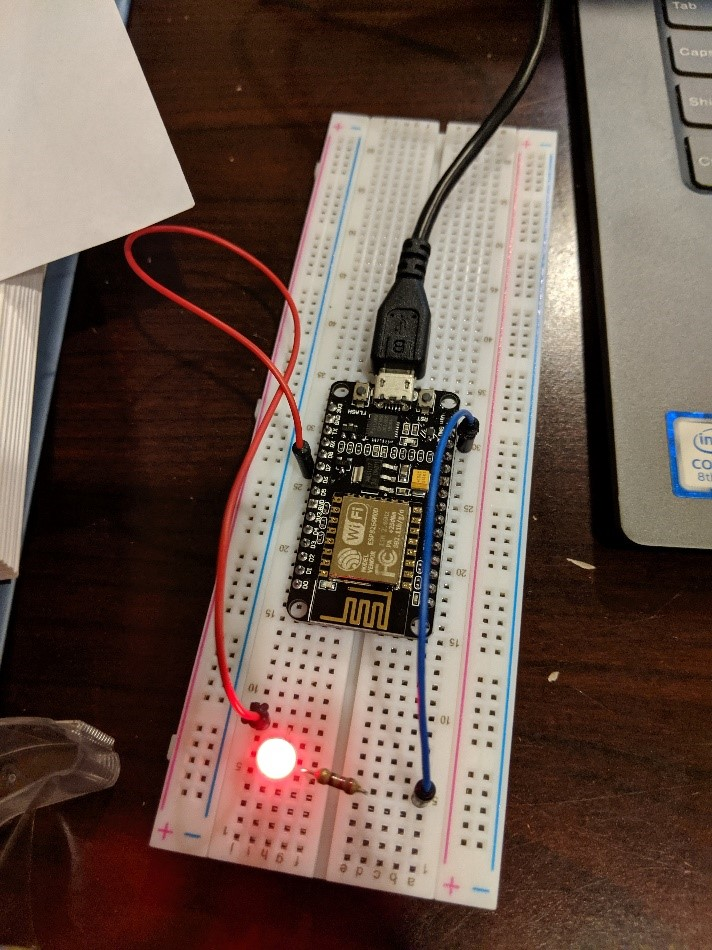 | 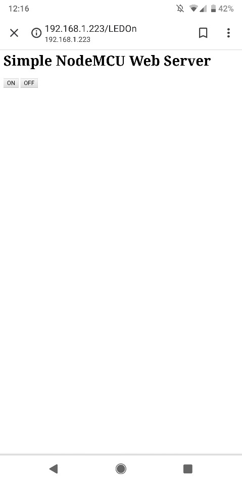 |
|-|-|

Off:

| 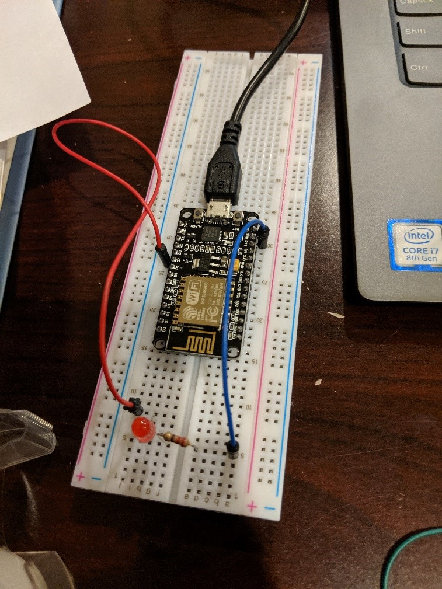 | 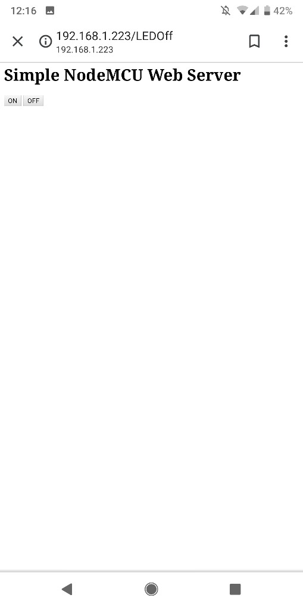 |
|-|-|

YESSSSSS IT WORKS OMGGGGG YAYYYYYYY

### Code

```arduino
#include <ESP8266WiFi.h>
#include <WiFiClient.h>
#include <ESP8266WebServer.h>
 
// Replace with your network credentials 
const char* ssid = "<WIFI NAME>";
const char* password = "<WIFI PASSWORD>";
 
ESP8266WebServer server(80);   //instantiate server at port 80 (http port)
 
String page = "";
int LEDPin = 13;
void setup(void){
  //the HTML of the web page
  page = "<h1>Simple NodeMCU Web Server</h1><p><a href=\"LEDOn\"><button>ON</button></a>&nbsp;<a href=\"LEDOff\"><button>OFF</button></a></p>";
  //make the LED pin output and initially turned off
  pinMode(LEDPin, OUTPUT);
  digitalWrite(LEDPin, LOW);
   
  delay(1000);
  Serial.begin(115200);
  WiFi.begin(ssid, password); //begin WiFi connection
  Serial.println("");
 
  // Wait for connection
  while (WiFi.status() != WL_CONNECTED) {
    delay(500);
    Serial.print(".");
  }
  Serial.println("");
  Serial.print("Connected to ");
  Serial.println(ssid);
  Serial.print("IP address: ");
  Serial.println(WiFi.localIP());
   
  server.on("/", [](){
    server.send(200, "text/html", page);
  });
  server.on("/LEDOn", [](){
    server.send(200, "text/html", page);
    digitalWrite(LEDPin, HIGH);
    delay(1000);
  });
  server.on("/LEDOff", [](){
    server.send(200, "text/html", page);
    digitalWrite(LEDPin, LOW);
    delay(1000); 
  });
  server.begin();
  Serial.println("Web server started!");
}
 
void loop(void){
  server.handleClient();
}
```

### Reflection

YES! So I got the wifi module to work ON ITS OWN, so we probably don’t need the Arduino at all!!! I think this board can take inputs and stuff; I will check tmr if I have enough (I might need the Arduino for more inputs), but this is a good first step to remote access! To build off of this proof of concept (POC), I will find a way to make a better HTML page and see if I can add an input from the water level sensor as well as control using the web socket.

## 7/22/2019

THIS GUY HAS EVERYTHING ABT ESP8266: [A Beginner's Guide to the ESP8266](https://tttapa.github.io/ESP8266/Chap01%20-%20ESP8266.html) – I’m actually just gonna read this entire doc it’s soooooo good!

### Research

- Alright so today’s goal is to add an input from the water detector and actually send that data to the webserver
- Maybe in the future, I can convert the Arduino code into C code because we’re working on the ESP8266 NodeMCU now, but still using Arduino IDE bc it’s easier
  - C = more optimization and some things the Arduino library doesn’t support (But Arduino IDE should be good enough for now)
- Also for the future, we probably want to create a WebSocket and get requests that way instead of pinging the server every few seconds (Too much battery)
  - ^ Very good intro website: [WebSockets with ESP8266](https://tttapa.github.io/ESP8266/Chap14%20-%20WebSocket.html)
  - But it has so much code omg…..
  - This example uses OTA (Over the Air) uploading of code (Which I don’t really need for now) – future implementation?
- AHA! I have found a way to add HTML code without writing it as a string literal!
  - May I introduce SPIFFS: [SPIFFS with ESP8266](https://tttapa.github.io/ESP8266/Chap11%20-%20SPIFFS.html)
- Another very interesting thing came up:
  - You can use the milli() function to check how many seconds since smth happened: [Arduino BlinkWithoutDelay Example](https://www.arduino.cc/en/Tutorial/BlinkWithoutDelay)
- More stuff to think about: BATTERY POWER!!!
  - I’m currently using a USB to Micro USB-B cable to connect the ESP8266 to the computer, but I need portable power supply
  - [Battery Holder to wires (2 AA) [7.4V] - 5 Pack](https://www.amazon.com/SACKORANGE-Plastic-Battery-Storage-Holder/dp/B06XT1DM74/ref=sr_1_4?keywords=circuit+board+battery+holder&qid=1563806660&s=gateway&sr=8-4)
  - [Battery Holder to DC Barrel Jack [4.5-6.5V]](https://www.adafruit.com/product/3784)
  - [AC Power if we want](https://www.amazon.com/SMAKN%C3%82-Switching-Supply-Adapter-100-240/dp/B00OZDY950)
  - [Dual Voltage Converter DC Barrel Jack to Pin Output](https://www.amazon.com/MakerSpot-Breadboard-Voltage-Solderless-Friendly/dp/B01IUYLVFK/ref=pd_lpo_sbs_147_t_2?_encoding=UTF8&psc=1&refRID=6GPX1KD9AP6EJVK9AK0F) 
  - ^ May need [Jumpers](https://www.amazon.com/2-54mm-Standard-Computer-Jumper-100pack/dp/B00N552DWK/ref=sr_1_9?keywords=Jumper&qid=1563807590&s=electronics&sr=1-9)
  - [DC Barrel Jack to Micro USB-B](https://www.amazon.com/Conwork-2-Pack-Jacket-Adapter-Cellphone/dp/B01G6EBGWO/ref=pd_lpo_sbs_147_t_1?_encoding=UTF8&psc=1&refRID=J5FC9YJ5AXZEQWHKMP2Z)

### Using SPIFFS

After years of trying to figure out why it didn’t work:

- [Arduino ESP8266 Plugin](https://github.com/esp8266/arduino-esp8266fs-plugin)
- You needed this thing!!! Ughhhh
- It will add an option in Tools > ESP8266 Sketch Data Upload
- THEN you can upload the actual sketch and run it

### Code

Sketch

```arduino
#include <ESP8266WiFi.h>
#include <WiFiClient.h>
#include <ESP8266mDNS.h>
#include <ESP8266WebServer.h>
#include <FS.h>

const char* ssid = "<WIFI NAME>";
const char* password = "<WIFI PASSWORD>";

ESP8266WebServer server(80);   //instantiate server at port 80 (http port)

String getContentType(String filename); // convert the file extension to the MIME type
bool handleFileRead(String path);       // send the right file to the client (if it exists)

int LEDPin = 13;

void setup(void) {
  //make the LED pin output and initially turned off
  pinMode(LEDPin, OUTPUT);
  digitalWrite(LEDPin, LOW);

  delay(1000);
  Serial.begin(115200);
  WiFi.begin(ssid, password); //begin WiFi connection
  Serial.println("");

  // Wait for connection
  while (WiFi.status() != WL_CONNECTED) {
    delay(500);
    Serial.print(".");
  }
  Serial.println("");
  Serial.print("Connected to ");
  Serial.println(ssid);
  Serial.print("IP address: ");
  Serial.println(WiFi.localIP());

  if (MDNS.begin("esp8266")) {              // Start the mDNS responder for esp8266.local
    Serial.println("mDNS responder started");
  } else {
    Serial.println("Error setting up MDNS responder!");
  }

  SPIFFS.begin();                           // Start the SPI Flash Files System

  server.onNotFound([]() {                              // If the client requests any URI
    if (!handleFileRead(server.uri()))                  // send it if it exists
      server.send(404, "text/plain", "404: Not Found"); // otherwise, respond with a 404 (Not Found) error
  });
  
  server.begin();
  Serial.println("Web server started!");
}

void loop(void) {
  server.handleClient();
}

String getContentType(String filename) { // convert the file extension to the MIME type
  if (filename.endsWith(".html")) return "text/html";
  else if (filename.endsWith(".css")) return "text/css";
  else if (filename.endsWith(".js")) return "application/javascript";
  else if (filename.endsWith(".ico")) return "image/x-icon";
  return "text/plain";
}

bool handleFileRead(String path) { // send the right file to the client (if it exists)
  Serial.println("handleFileRead: " + path);
  if (path.endsWith("/")) path += "index.html";         // If a folder is requested, send the index file
  String contentType = getContentType(path);            // Get the MIME type
  if (SPIFFS.exists(path)) {                            // If the file exists
    File file = SPIFFS.open(path, "r");                 // Open it
    size_t sent = server.streamFile(file, contentType); // And send it to the client
    file.close();                                       // Then close the file again
    return true;
  }
  Serial.println("\tFile Not Found");
  return false;                                         // If the file doesn't exist, return false
}
```

HTML

```html
<!DOCTYPE html>
<html lang="en">
<head>
    <meta charset="UTF-8">
    <meta name="viewport" content="width=device-width, initial-scale=1.0">
    <meta http-equiv="X-UA-Compatible" content="ie=edge">
    <title>ESP8266 Node MCU</title>
</head>
<body>
    <h1>Hello!</h1>
</body>
</html>
```

For future refrence (The ESP8266 NodeMCU Pinout diagram)

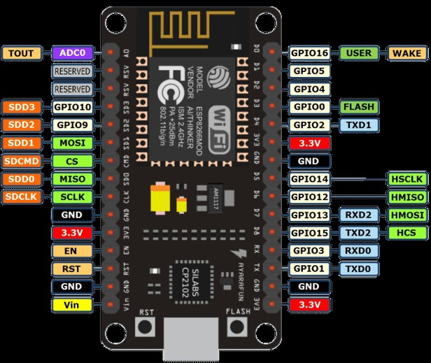

### The WebSocket

- OKAY SO… I’m going off on a tangent and I’m going to build a traffic light system using the WebSocket for remote control as well as implement the milli() function to run the lights
- I will use GPIO 15 (Green), 13 (Yellow), and 12 (Red)
- It will be on a timer => 7 sec for green, 3 sec for yellow, 10 sec for red (Converted to milliseconds)
- We need this library: [Github - Arduino WebSockets](https://github.com/Links2004/arduinoWebSockets)
- Sigh it doesn’t work I’ll fix it tmr

## 7/23/2019

### AnalogWrite thing

- So basically you can send PWM to the LEDs
- [Arduino PWM Tutorial](https://www.arduino.cc/en/Tutorial/PWM)
- And so I set up a simple test that slowly increases in brightness over a period of about 2 sec (Using the analogWrite() function)

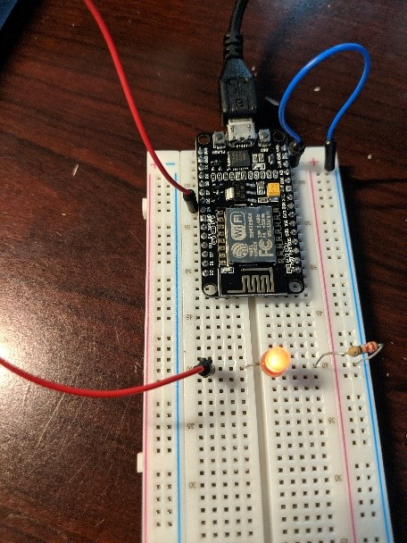

```arduino
#define RED_LED 12

void setup() {
  pinMode(RED_LED, OUTPUT);
}

void loop() {
  analogWrite(RED_LED, (millis() / 10) % 255);
}
```

### BIG CHANGES

- I'm going to try to use C programming to write code for the ESP8266, NO MORE ARDUINO!!!
- [ESP8266 SDK Tutorial](https://hackaday.io/project/160006-esp8266-sdk-tutorials) -> VERY good guide on how to install the toolchain
- I will be using the Windows Ubuntu Bash Shell to run the toolchain: [esp-open-sdk](https://github.com/pfalcon/esp-open-sdk)

## 7/24/2019

### Sigh

- Okay so basically after installing the complete toolchain, the WSL can’t detect the COM port!!! >:(
- So we’re gonna go back to Arduino and try to figure out how to get it to work -_-

### IT WORKS (The WebSocket)

- So basically after isolation of parts of the code, I was able to get a WORKING WEBSOCKET!!!
- The ESP8266 connects to the internet and creates a softAP, this will allow us to access the webpage through the IP Adress
- Future Apps:
  - Be able to access it through a mDNS (esp8266.local)
- This current program runs the traffic light while allowing us to control it and change the state at any time, restarting the timer

### Code

Arduino

```arduino
#include <ESP8266WiFi.h>
#include <WiFiClient.h>
#include <ESP8266WiFiMulti.h>
#include <ESP8266WebServer.h>
#include <FS.h>
#include <WebSocketsServer.h>

#define LED_RED 12
#define LED_YELLOW 13
#define LED_GREEN 15

ESP8266WiFiMulti wifiMulti;     // Create an instance of the ESP8266WiFiMulti class, called 'wifiMulti'
ESP8266WebServer server(80);    // Create a webserver object that listens for HTTP request on port 80
WebSocketsServer webSocket(81);    // create a websocket server on port 81

const char *ssid = "FiOS-089NC"; //MY WIFI NETWORK
const char *password = "6969elite7684husky"; //MY WIFI PASSWORD

const char *newSsid = "ESP8266 Access Point"; // The name of the Wi-Fi network that will be created
const char *newPassword = "thereisnospoon";   // The password required to connect to it, leave blank for an open network

String getContentType(String filename); // convert the file extension to the MIME type
bool handleFileRead(String path);       // send the right file to the client (if it exists)
void changeState(); //changes the state of the traffic light to the next one
bool timeTest(int changeTime); //Tests to see if the time elapsed is enough for the light cycle
void changeLED(); //Changes the state of the LED based on the state variable
void forceState(); //Change on websocket event

String state = "GREEN";
unsigned long previousMillis = 0;

/*_____SETUP_____*/

void setup(void) {
  
  //make the LED pin output and initially turned off
  pinMode(LED_RED, OUTPUT);
  pinMode(LED_YELLOW, OUTPUT);
  pinMode(LED_GREEN, OUTPUT);
  changeLED();
  
  Serial.begin(115200);        // Start the Serial communication to send messages to the computer
  delay(10);
  Serial.println("\r\n");

  startWiFi();                 // Start a Wi-Fi access point, and try to connect to some given access points. Then wait for either an AP or STA connection
  startSPIFFS();               // Start the SPIFFS and list all contents
  startWebSocket();            // Start a WebSocket server
  startServer();               // Start a HTTP server with a file read handler and an upload handler
}

/*_____LOOP_____*/

void loop() {
  webSocket.loop();                           // constantly check for websocket events
  server.handleClient();                      // run the server
  changeState();
}

/*_____SETUP_FUNCTIONS_____*/

void startWiFi() { // Start a Wi-Fi access point, and try to connect to some given access points. Then wait for either an AP or STA connection
  WiFi.softAP(newSsid, newPassword);             // Start the access point
  Serial.print("Access Point \"");
  Serial.print(ssid);
  Serial.println("\" started\r\n");

  wifiMulti.addAP(ssid, password);   // add Wi-Fi networks you want to connect to

  Serial.println("Connecting");
  while (wifiMulti.run() != WL_CONNECTED && WiFi.softAPgetStationNum() < 1) {  // Wait for the Wi-Fi to connect
    delay(250);
    Serial.print('.');
  }
  Serial.println("\r\n");
  if (WiFi.softAPgetStationNum() == 0) {     // If the ESP is connected to an AP
    Serial.print("Connected to ");
    Serial.println(WiFi.SSID());             // Tell us what network we're connected to
    Serial.print("IP address:\t");
    Serial.print(WiFi.localIP());            // Send the IP address of the ESP8266 to the computer
  } else {                                   // If a station is connected to the ESP SoftAP
    Serial.print("Station connected to ESP8266 AP");
  }
  Serial.println("\r\n");
}

void startSPIFFS() { // Start the SPIFFS and list all contents
  SPIFFS.begin();                             // Start the SPI Flash File System (SPIFFS)
  Serial.println("SPIFFS started. Contents:");
  {
    Dir dir = SPIFFS.openDir("/");
    while (dir.next()) {                      // List the file system contents
      String fileName = dir.fileName();
      size_t fileSize = dir.fileSize();
      Serial.printf("\tFS File: %s, size: %s\r\n", fileName.c_str(), formatBytes(fileSize).c_str());
    }
    Serial.printf("\n");
  }
}

void startWebSocket() { // Start a WebSocket server
  webSocket.begin();                          // start the websocket server
  webSocket.onEvent(webSocketEvent);          // if there's an incomming websocket message, go to function 'webSocketEvent'
  Serial.println("WebSocket server started.");
}

void startServer() { // Start a HTTP server with a file read handler and an upload handler
  server.onNotFound(handleNotFound);
  server.begin();                             // start the HTTP server
  Serial.println("HTTP server started.");
}

/*__________________________________________________________SERVER_HANDLERS__________________________________________________________*/

void handleNotFound() { // if the requested file or page doesn't exist, return a 404 not found error
  if (!handleFileRead(server.uri())) {        // check if the file exists in the flash memory (SPIFFS), if so, send it
    server.send(404, "text/plain", "404: File Not Found");
  }
}

bool handleFileRead(String path) { // send the right file to the client (if it exists)
  Serial.println("handleFileRead: " + path);
  if (path.endsWith("/")) path += "index.html";          // If a folder is requested, send the index file
  String contentType = getContentType(path);             // Get the MIME type
  String pathWithGz = path + ".gz";
  if (SPIFFS.exists(pathWithGz) || SPIFFS.exists(path)) { // If the file exists, either as a compressed archive, or normal
    if (SPIFFS.exists(pathWithGz))                         // If there's a compressed version available
      path += ".gz";                                         // Use the compressed verion
    File file = SPIFFS.open(path, "r");                    // Open the file
    size_t sent = server.streamFile(file, contentType);    // Send it to the client
    file.close();                                          // Close the file again
    Serial.println(String("\tSent file: ") + path);
    return true;
  }
  Serial.println(String("\tFile Not Found: ") + path);   // If the file doesn't exist, return false
  return false;
}

void webSocketEvent(uint8_t num, WStype_t type, uint8_t * payload, size_t lenght) { // When a WebSocket message is received
  switch (type) {
    case WStype_DISCONNECTED:             // if the websocket is disconnected
      Serial.printf("[%u] Disconnected!\n", num);
      break;
    case WStype_CONNECTED: {              // if a new websocket connection is established
        IPAddress ip = webSocket.remoteIP(num);
        Serial.printf("[%u] Connected from %d.%d.%d.%d url: %s\n", num, ip[0], ip[1], ip[2], ip[3], payload);
      }
      break;
    case WStype_TEXT:                     // if new text data is received
      Serial.printf("[%u] get Text: %s\n", num, payload);
      forceState(payload[0]);
      break;
  }
}

/*__________________________________________________________HELPER_FUNCTIONS__________________________________________________________*/

String formatBytes(size_t bytes) { // convert sizes in bytes to KB and MB
  if (bytes < 1024) {
    return String(bytes) + "B";
  } else if (bytes < (1024 * 1024)) {
    return String(bytes / 1024.0) + "KB";
  } else if (bytes < (1024 * 1024 * 1024)) {
    return String(bytes / 1024.0 / 1024.0) + "MB";
  }
}

String getContentType(String filename) { // determine the filetype of a given filename, based on the extension
  if (filename.endsWith(".html")) return "text/html";
  else if (filename.endsWith(".css")) return "text/css";
  else if (filename.endsWith(".js")) return "application/javascript";
  else if (filename.endsWith(".ico")) return "image/x-icon";
  else if (filename.endsWith(".gz")) return "application/x-gzip";
  return "text/plain";
}

void changeState() {
  String oldState = state;
  if (state == "GREEN" && timeTest(7000)) state = "YELLOW";
  if (state == "YELLOW" && timeTest(3000)) state = "RED";
  if (state == "RED" && timeTest(10000)) state = "GREEN";
  if (oldState != state) {
    changeLED();
  }
}

bool timeTest(int changeTime) {
  if (millis() - previousMillis > changeTime) {
    previousMillis = millis();
    return true;
  }
  return false;
}

void changeLED() { 
  digitalWrite(LED_GREEN, LOW);
  digitalWrite(LED_YELLOW, LOW);
  digitalWrite(LED_RED, LOW);
  if (state == "GREEN") {
    digitalWrite(LED_GREEN, HIGH);
  }
  else if (state == "YELLOW") {
    digitalWrite(LED_YELLOW, HIGH);
  }
  else if (state == "RED") {
    digitalWrite(LED_RED, HIGH);
  }
}

void forceState(char col) {
  if (col == 'R') {
    state = "RED";
  }
  else if (col == 'Y') {
    state = "YELLOW";
  }
  else {
    state = "GREEN";
  }
  previousMillis = millis();
  changeLED();
}
```

HTML

```html
<!DOCTYPE html>
<html lang="en">
<head>
    <meta charset="UTF-8">
    <meta name="viewport" content="width=device-width, initial-scale=1.0">
    <meta http-equiv="X-UA-Compatible" content="ie=edge">
    <title>ESP8266 Node MCU</title>
</head>
<body>
    <h1>Control My Traffic Light!</h1>
    <button onclick="changeState('R')">RED</button><br>
    <button onclick="changeState('Y')">YELLOW</button><br>
    <button onclick="changeState('G')">GREEN</button><br>
</body>
<script src="WebSocket.js" type="text/javascript"></script>
</html>
```

Javascript

```js
var connection = new WebSocket('ws://' + location.hostname + ':81/', ['arduino']);
connection.onopen = function () {
  connection.send('Connect ' + new Date());
};
connection.onerror = function (error) {
  console.log('WebSocket Error ', error);
};
connection.onmessage = function (e) {
  console.log('Server: ', e.data);
};
connection.onclose = function () {
  console.log('WebSocket connection closed');
};

function changeState(color) {
  console.log(color);
  connection.send(color);
}
```

### Notes

- The next step is to add input devices to the ESP8266 and adapt this example to the watering system
- I want to eventually make a web server using AWS and have the ESP8266 connect to that, with a WebSocket
- I have also migrated it VSCode!!!
- ^ Still have to figure out how to use the ESP8266 8266 Plugin to upload data to the chip in VSCode
- Strange issue with SPIFFS upload
  - It only works when I restart Arduino IDE

### Adding the Input

- So I have added the original float switch into the circuit
- Currently, we can control one LED from the float switch
- The other LED is controlled using the server and WebSocket


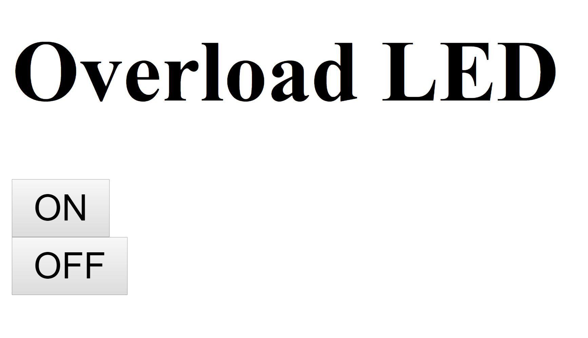

### Code

Arduino

```arduino
#include <ESP8266WiFi.h>
#include <WiFiClient.h>
#include <ESP8266WiFiMulti.h>
#include <ESP8266WebServer.h>
#include <FS.h>
#include <WebSocketsServer.h>

#define DISPLAY_LED 12
#define OVERLOAD_LED 13
#define FLOAT_SWITCH 14

ESP8266WiFiMulti wifiMulti;     // Create an instance of the ESP8266WiFiMulti class, called 'wifiMulti'
ESP8266WebServer server(80);    // Create a webserver object that listens for HTTP request on port 80
WebSocketsServer webSocket(81);    // create a websocket server on port 81

const char *ssid = "FiOS-089NC"; //MY WIFI NETWORK
const char *password = "6969elite7684husky"; //MY WIFI PASSWORD

const char *newSsid = "ESP8266 Access Point"; // The name of the Wi-Fi network that will be created
const char *newPassword = "";   // The password required to connect to it, leave blank for an open network

String getContentType(String filename); // convert the file extension to the MIME type
bool handleFileRead(String path);       // send the right file to the client (if it exists)

int buttonState = 0;

/*_____SETUP_____*/

void setup(void) {
  pinMode(DISPLAY_LED, OUTPUT);
  pinMode(OVERLOAD_LED, OUTPUT);
  pinMode(FLOAT_SWITCH, INPUT);
  digitalWrite(OVERLOAD_LED, LOW);
  
  Serial.begin(115200);        // Start the Serial communication to send messages to the computer
  delay(10);
  Serial.println("\r\n");

  startWiFi();                 // Start a Wi-Fi access point, and try to connect to some given access points. Then wait for either an AP or STA connection
  startSPIFFS();               // Start the SPIFFS and list all contents
  startWebSocket();            // Start a WebSocket server
  startServer();               // Start a HTTP server with a file read handler and an upload handler
}

/*_____LOOP_____*/

void loop() {
  webSocket.loop();                           // constantly check for websocket events
  server.handleClient();                      // run the server

  buttonState = digitalRead(FLOAT_SWITCH);
  if (buttonState == HIGH) {
    digitalWrite(DISPLAY_LED, HIGH);
  }
  else {
    digitalWrite(DISPLAY_LED, LOW);
  }
}

/*_____SETUP_FUNCTIONS_____*/

void startWiFi() { // Start a Wi-Fi access point, and try to connect to some given access points. Then wait for either an AP or STA connection
  WiFi.softAP(newSsid, newPassword);             // Start the access point
  Serial.print("Access Point \"");
  Serial.print(ssid);
  Serial.println("\" started\r\n");

  wifiMulti.addAP(ssid, password);   // add Wi-Fi networks you want to connect to

  Serial.println("Connecting");
  while (wifiMulti.run() != WL_CONNECTED && WiFi.softAPgetStationNum() < 1) {  // Wait for the Wi-Fi to connect
    delay(250);
    Serial.print('.');
  }
  Serial.println("\r\n");
  if (WiFi.softAPgetStationNum() == 0) {     // If the ESP is connected to an AP
    Serial.print("Connected to ");
    Serial.println(WiFi.SSID());             // Tell us what network we're connected to
    Serial.print("IP address:\t");
    Serial.print(WiFi.localIP());            // Send the IP address of the ESP8266 to the computer
  } else {                                   // If a station is connected to the ESP SoftAP
    Serial.print("Station connected to ESP8266 AP");
  }
  Serial.println("\r\n");
}

void startSPIFFS() { // Start the SPIFFS and list all contents
  SPIFFS.begin();                             // Start the SPI Flash File System (SPIFFS)
  Serial.println("SPIFFS started. Contents:");
  {
    Dir dir = SPIFFS.openDir("/");
    while (dir.next()) {                      // List the file system contents
      String fileName = dir.fileName();
      size_t fileSize = dir.fileSize();
      Serial.printf("\tFS File: %s, size: %s\r\n", fileName.c_str(), formatBytes(fileSize).c_str());
    }
    Serial.printf("\n");
  }
}

void startWebSocket() { // Start a WebSocket server
  webSocket.begin();                          // start the websocket server
  webSocket.onEvent(webSocketEvent);          // if there's an incomming websocket message, go to function 'webSocketEvent'
  Serial.println("WebSocket server started.");
}

void startServer() { // Start a HTTP server with a file read handler and an upload handler
  server.onNotFound(handleNotFound);
  server.begin();                             // start the HTTP server
  Serial.println("HTTP server started.");
}

/*_____SERVER_HANDLERS_____*/

void handleNotFound() { // if the requested file or page doesn't exist, return a 404 not found error
  if (!handleFileRead(server.uri())) {        // check if the file exists in the flash memory (SPIFFS), if so, send it
    server.send(404, "text/plain", "404: File Not Found");
  }
}

bool handleFileRead(String path) { // send the right file to the client (if it exists)
  Serial.println("handleFileRead: " + path);
  if (path.endsWith("/")) path += "index.html";          // If a folder is requested, send the index file
  String contentType = getContentType(path);             // Get the MIME type
  String pathWithGz = path + ".gz";
  if (SPIFFS.exists(pathWithGz) || SPIFFS.exists(path)) { // If the file exists, either as a compressed archive, or normal
    if (SPIFFS.exists(pathWithGz))                         // If there's a compressed version available
      path += ".gz";                                         // Use the compressed verion
    File file = SPIFFS.open(path, "r");                    // Open the file
    size_t sent = server.streamFile(file, contentType);    // Send it to the client
    file.close();                                          // Close the file again
    Serial.println(String("\tSent file: ") + path);
    return true;
  }
  Serial.println(String("\tFile Not Found: ") + path);   // If the file doesn't exist, return false
  return false;
}

void webSocketEvent(uint8_t num, WStype_t type, uint8_t * payload, size_t lenght) { // When a WebSocket message is received
  switch (type) {
    case WStype_DISCONNECTED:             // if the websocket is disconnected
      Serial.printf("[%u] Disconnected!\n", num);
      break;
    case WStype_CONNECTED: {              // if a new websocket connection is established
        IPAddress ip = webSocket.remoteIP(num);
        Serial.printf("[%u] Connected from %d.%d.%d.%d url: %s\n", num, ip[0], ip[1], ip[2], ip[3], payload);
      }
      break;
    case WStype_TEXT:                     // if new text data is received
      Serial.printf("[%u] get Text: %s\n", num, payload);
      if (payload[0] == 'Y') {
        digitalWrite(OVERLOAD_LED, HIGH);
      }
      else {
        digitalWrite(OVERLOAD_LED, LOW);
      }
      break;
  }
}

/*_____HELPER_FUNCTIONS_____*/

String formatBytes(size_t bytes) { // convert sizes in bytes to KB and MB
  if (bytes < 1024) {
    return String(bytes) + "B";
  } else if (bytes < (1024 * 1024)) {
    return String(bytes / 1024.0) + "KB";
  } else if (bytes < (1024 * 1024 * 1024)) {
    return String(bytes / 1024.0 / 1024.0) + "MB";
  }
}

String getContentType(String filename) { // determine the filetype of a given filename, based on the extension
  if (filename.endsWith(".html")) return "text/html";
  else if (filename.endsWith(".css")) return "text/css";
  else if (filename.endsWith(".js")) return "application/javascript";
  else if (filename.endsWith(".ico")) return "image/x-icon";
  else if (filename.endsWith(".gz")) return "application/x-gzip";
  return "text/plain";
}
```

HTML

```html
<!DOCTYPE html>
<html lang="en">
<head>
    <meta charset="UTF-8">
    <meta name="viewport" content="width=device-width, initial-scale=1.0">
    <meta http-equiv="X-UA-Compatible" content="ie=edge">
    <title>ESP8266 Node MCU</title>
</head>
<body>
    <h1>Overload LED</h1>
    <button onclick="changeState('Y')">ON</button><br>
    <button onclick="changeState('N')">OFF</button><br>
</body>
<script src="WebSocket.js" type="text/javascript"></script>
</html>
```

Javascript

```js
var connection = new WebSocket('ws://' + location.hostname + ':81/', ['arduino']);
connection.onopen = function () {
  connection.send('Connect ' + new Date());
};
connection.onerror = function (error) {
  console.log('WebSocket Error ', error);
};
connection.onmessage = function (e) {
  console.log('Server: ', e.data);
};
connection.onclose = function () {
  console.log('WebSocket connection closed');
};

function changeState(on) {
  connection.send(on);
}
```

### Reflection

Today, there was a lot achieved in the direction of the server! I was able to create a WebSocket to connect to the ESP8266, which acted as a server. My hope for tomorrow is that I can start using AWS and create a server using that. Then, I would use the ESP8266 as a client and connect to the AWS server, using a WebSocket to get requests. The user would also access this server using their client. Goal for tomorrow: Learn how to use AWS!

## 7/25/2019

### Initialized the AWS EC2 Ubuntu Instance

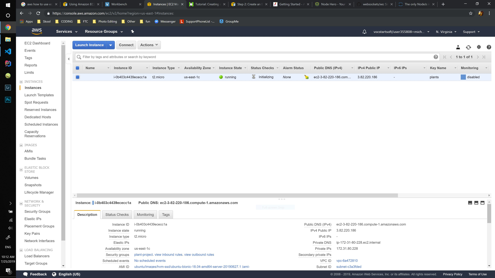

- [This is a great tutorial to set up a Node.js server](https://hackernoon.com/tutorial-creating-and-managing-a-node-js-server-on-aws-part-1-d67367ac5171)
- [Get a file using SCP from SSH connection](https://stackoverflow.com/questions/9427553/how-to-download-a-file-from-server-using-ssh)

### Created a Node.js server

app.js

```js
const express = require('express')
const app = express()
app.get('/', (req, res) => {
  res.send('Hello World!')
})
app.listen(3000, () => console.log('Server running on port 3000'))
```

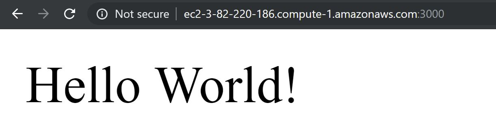

### The Valve System

The Parts that we need:

- [The Valve](https://www.amazon.com/DIGITEN-Solenoid-Connect-normally-Closed/dp/B071JDFVNQ/ref=asc_df_B016MP1HX0/?tag=hyprod-20&linkCode=df0&hvadid=167151752767&hvpos=1o3&hvnetw=g&hvrand=8652232491165131651&hvpone=&hvptwo=&hvqmt=&hvdev=c&hvdvcmdl=&hvlocint=&hvlocphy=9026804&hvtargid=pla-316038536137&th=1)
- [The Tubing](https://www.amazon.com/PureSec-4TU-BLUE-Certified-70%C2%B0F-120PSI-150%C2%B0F-60PSI/dp/B01N4JZZ4Y/ref=pd_cp_60_2?pd_rd_w=BXTS9&pf_rd_p=ef4dc990-a9ca-4945-ae0b-f8d549198ed6&pf_rd_r=6F80GJGEPA2JDQD6ZX27&pd_rd_r=351fb475-b214-409c-8ff2-b9c047dbd27f&pd_rd_wg=7gkej&pd_rd_i=B01N4JZZ4Y&psc=1&refRID=6F80GJGEPA2JDQD6ZX27)
- [Loctite Clear Silicone Waterproof Sealant 2.7-Ounce Tube](https://www.amazon.com/Loctite-Silicone-Waterproof-2-7-Ounce-908570/dp/B0002BBX3U)
- [8 Channel Relay Module](https://www.amazon.com/SainSmart-101-70-102-8-Channel-Relay-Module/dp/B0057OC5WK)

Still don't know how I'm gonna make the water tank/box but that's okay for now

### Water Tank CAD

- Going to design the water tank in Autodesk Inventor
- So we could make the water tank removeable from the electronics module
  - And se we would need the jug sealed to a hand valve, which is connected to a screwable connector, which is screwed on to another tube, which leads into the electronic valve, which leads to the tank thing
- Finished basic design today
  - Still need to add wires and battery module
  - [How to Add Wires](https://knowledge.autodesk.com/support/inventor-products/learn-explore/caas/CloudHelp/cloudhelp/2019/ENU/Inventor-Help/files/GUID-880B91B4-8E64-451C-BE90-70EF8920E34C-htm.html)
  - [Water Bottle I'm using as a water tank](https://www.target.com/p/ozarka-brand-100-natural-spring-water-101-4-fl-oz-jug/-/A-13052112?ref=tgt_adv_XS000000&AFID=google_pla_df&fndsrc=tgtao&CPNG=PLA_Grocery%2BShopping_Local&adgroup=SC_Grocery&LID=700000001170770pgs&network=g&device=c&location=9026804&ds_rl=1246978&ds_rl=1247077&ds_rl=1246978&gclid=CjwKCAjwpuXpBRAAEiwAyRRPgcaBEBNUaWOALdpB5_KzNWNR7w6STYEUnB9ztlkRgO-Csq-IPxrQ6BoCGrkQAvD_BwE&gclsrc=aw.ds)

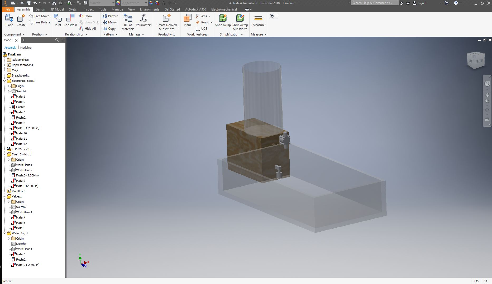

### Final Shopping List

Home Depot

- [Plywood 1/4in x 2ft x 2ft](https://www.homedepot.com/p/Sanded-Plywood-Common-1-4-in-x-2-ft-x-2-ft-Actual-0-224-in-x-23-75-in-x-23-75-in-1502002/202089013)
- [Corner Bracket 4-pack (4)](https://www.homedepot.com/p/Everbilt-3-4-in-Zinc-Plated-Corner-Braces-4-Pack-13542/202950157?MERCH=REC-_-PIPHorizontal2_rr-_-202033892-_-202950157-_-N)
- Screws and Nuts for the Brackets
- (Maybe) Reciprocating Saw
- [Cabinet Hinge](https://www.homedepot.com/p/Liberty-Matte-Black-Self-Closing-Overlay-Cabinet-Hinge-1-Pair-H0103AZ-FB-O3/204151933)

Amazon

- [Soldering Kit bc I don't have one](https://www.amazon.com/dp/B01712N5C4?creativeASIN=B01712N5C4&linkCode=w61&imprToken=jCVqhmifgfVLwB2HO92KCw&slotNum=1&tag=iknowthebest-20)
- [50 grams Solder Material](https://www.amazon.com/MAIYUM-63-37-Solder-Electrical-Soldering/dp/B075WB98FJ/ref=pd_bxgy_469_2/131-2783987-3110648?_encoding=UTF8&pd_rd_i=B075WB98FJ&pd_rd_r=d01e2fc4-1266-4d4a-a0a6-9b86d5f81455&pd_rd_w=FtHp7&pd_rd_wg=6N5M1&pf_rd_p=a2006322-0bc0-4db9-a08e-d168c18ce6f0&pf_rd_r=WM5P5NN1BS0MTJ4PBNH0&psc=1&refRID=WM5P5NN1BS0MTJ4PBNH0)
- [Stepdown Module 6-pack](https://www.amazon.com/MP1584EN-DC-DC-Converter-Adjustable-Module/dp/B01MQGMOKI/ref=pd_day0_hl_229_1/131-2783987-3110648?_encoding=UTF8&pd_rd_i=B01MQGMOKI&pd_rd_r=f974abb4-376c-4b13-a836-c41eaf9d17e1&pd_rd_w=fyi2h&pd_rd_wg=ntIxY&pf_rd_p=ad07871c-e646-4161-82c7-5ed0d4c85b07&pf_rd_r=E9VX1YDAXY6MDVG14SCS&psc=1&refRID=E9VX1YDAXY6MDVG14SCS)
- [Battery Holder](https://www.amazon.com/SACKORANGE-Plastic-Battery-Storage-Holder/dp/B06XT1DM74/ref=sr_1_4?keywords=circuit+board+battery+holder&qid=1563806660&s=gateway&sr=8-4)
- [Loctite Clear Silicone Waterproof Sealant 2.7-Ounce Tube](https://www.amazon.com/Loctite-Silicone-Waterproof-2-7-Ounce-908570/dp/B0002BBX3U)
